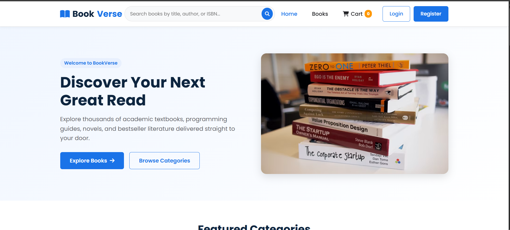
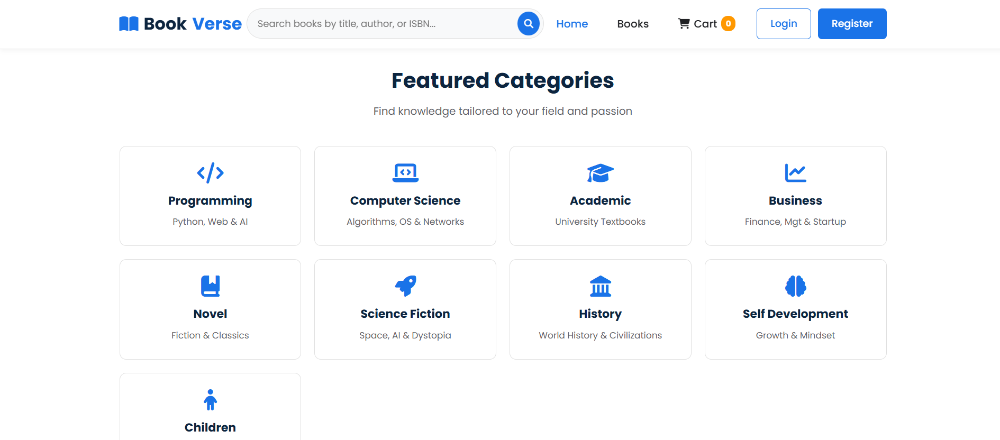
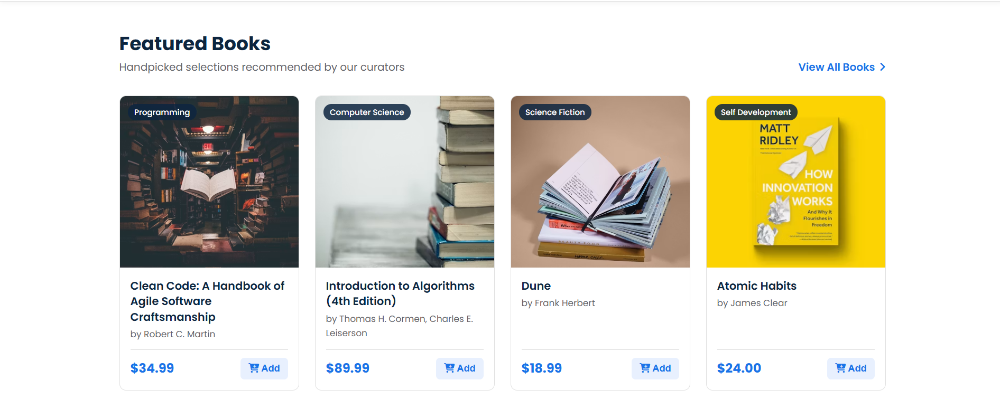
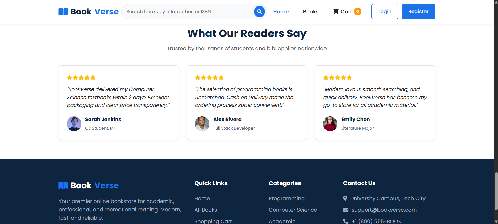
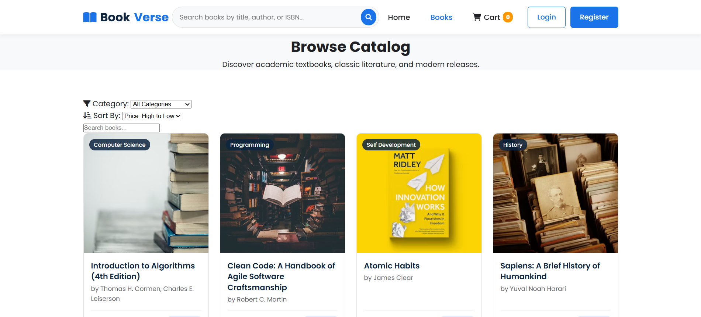
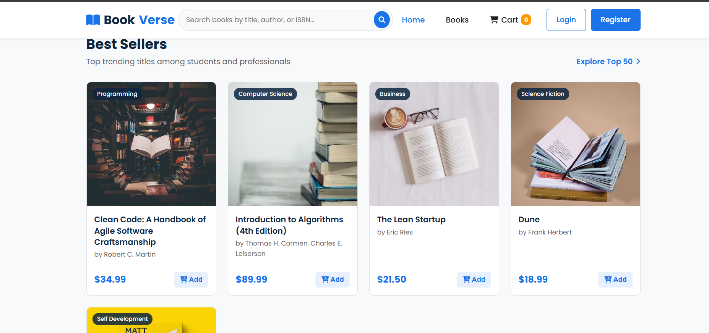
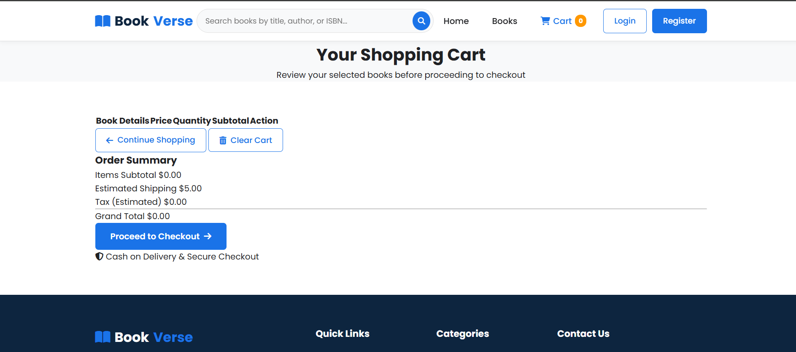

# 📚 BookVerse - Full Stack E-commerce Web Application

**BookVerse** is a modern, responsive, and fully functional online bookstore e-commerce web application developed as a university assignment. It features a clean **Blue & White** UI theme, user authentication, catalog searching and filtering, shopping cart functionality, checkout processing, order storage, and an administrative panel powered by Django.

🌐 **Live Demo:** [Click Here to View App](https://nawsintabassum.github.io/CodeAlpha_Simple-E-commers-Store-BookVerse-/ )

## Dashboard Preview









---

## 🛠️ Tech Stack

### Frontend
- **HTML5**: Semantic markup layout.
- **CSS3**: Custom modern styling, CSS Grid, Flexbox, variables, hover effects, smooth transitions, and responsive layout (`style.css`, `responsive.css`).
- **JavaScript (Vanilla ES6)**: Modular scripts (`app.js`, `cart.js`, `auth.js`) handling dynamic rendering, filtering, cart calculations via `localStorage`, and API interaction.
- **Google Fonts**: *Poppins* (300, 400, 500, 600, 700).
- **Icons**: FontAwesome 6.4.0.

### Backend
- **Python**: Core programming language.
- **Django**: Full-stack web backend framework.
- **Django REST Framework (DRF)**: API endpoints for books, user authentication, and order processing.
- **Django CORS Headers**: Enables seamless cross-origin communication between the frontend and Django server.

### Database
- **SQLite3**: Relational database engine storing users, categories, books, and order details.

---

## 📂 Project Structure

```text
BookVerse/
│
├── frontend/
│   ├── index.html           # Home Page (Hero, Categories, Featured, Reviews)
│   ├── books.html           # Book Catalog, Search & Filtering
│   ├── book-details.html    # Single Book Information & Detail View
│   ├── cart.html            # Shopping Cart Management
│   ├── checkout.html        # Shipping Info & Cash on Delivery Form
│   ├── login.html           # User Login Interface
│   └── register.html        # User Registration Interface
│
├── css/
│   ├── style.css            # Global Theme Styles (Blue & White)
│   └── responsive.css       # Mobile & Tablet Breakpoint Styling
│
├── js/
│   ├── app.js               # Dynamic Catalog Rendering, Filtering & Searching
│   ├── cart.js              # Cart State Management & Total Calculations
│   └── auth.js              # Authentication, Session Storage & Mobile Nav
│
├── backend/
│   ├── manage.py            # Django CLI Utility
│   ├── bookverse/           # Project Configuration
│   │   ├── settings.py      # App Config, CORS & DRF Settings
│   │   ├── urls.py          # Root URL Mapping
│   │   └── wsgi.py          # WSGI Deployment Config
│   └── store/               # Main E-commerce App
│       ├── models.py        # Category, Book, Order, OrderItem Data Models
│       ├── views.py         # Auth, Catalog & Order REST API Views
│       ├── urls.py          # API Endpoint Mapping
│       └── admin.py         # Django Admin Panel Configuration
│
└── README.md                # Project Documentation